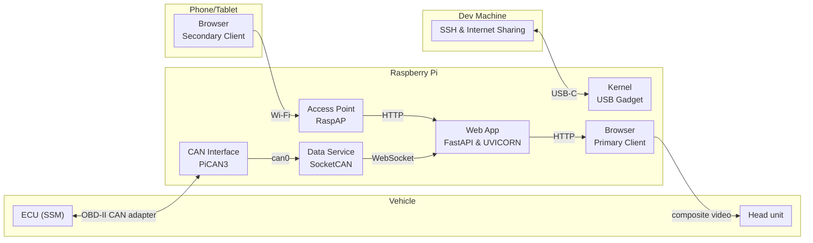

# autopi

## Summary

**autopi** is a Raspberry Pi project for live Subaru engine telemetry over CAN. A PiCAN3 hat talks to the ECU with Subaru’s **SSM** protocol (OBD-II is available as a fallback). The Pi runs a collector that polls parameters and streams them over a WebSocket, plus a small web dashboard for gauges and charts.

Typical use: plug the Pi into the car (and optionally a Mac over USB gadget for admin/SSH), join the guest Wi‑Fi AP from a phone, and open the dashboard. During development you can run the same stack on your laptop through an SSH tunnel to `socketcand` on the Pi.

## Example Dashbaord View
https://github.com/user-attachments/assets/57caf278-525e-41d4-851a-ecd953c2f85f

**Setup and running:** see [SETUP.md](SETUP.md).

## System diagram

Diagram source is [Mermaid](https://mermaid.js.org/) (renders on GitHub, GitLab, and many Markdown previews).

## Why is data logging a Subaru difficult?

High-speed logging on a **2011 USDM WRX STI** is harder than plugging in a generic OBD dongle and reading PIDs. The car’s OBD-II port still speaks **CAN**, but the useful engine data lives behind Subaru’s proprietary **SSM** (Subaru Select Monitor) protocol—not the standardized Mode 01 PIDs most consumer tools use.

### What SSM is

SSM is Subaru’s diagnostic/logging protocol. On this generation of ECU it rides **ISO-TP** (ISO 15765-2) over the same CAN IDs used for emissions diagnostics (`0x7E0` request → `0x7E8` response). You don’t ask for “RPM” by a public PID; you ask for **raw memory addresses** inside the ECU (e.g. coolant, IAT, DAM/IAM, fine knock), then apply ROM-specific conversion formulas to turn bytes into engineering units.

A session typically starts with an SSM **init** (`0xBF`), which returns a **5-byte ECU ID**. That ID selects the correct address map (this project defaults to `5C42504007` for a stock 2011 STI / ROM family such as `22611AP850`). The high-rate path is an SSM **batch read** (`0xA8`): list many 3-byte addresses in one request and get one response payload back.

### Why it’s complicated (especially at high rate)

- **Not standard OBD.** Generic ELM327-style adapters and apps speak SAE J1979. They won’t expose Subaru-only channels (knock correction, DAM, many timing/fuel trims) without an SSM-aware stack.
- **Address maps are ROM-specific.** The same “parameter” can live at different addresses across calibrations, markets, and tunes. Wrong map → garbage numbers or failed reads. Community definitions (e.g. RomRaider-style defs) must be matched to *your* ECU ID.
- **ISO-TP framing overhead.** Batch payloads often exceed a single CAN frame, so the bus uses first/consecutive frames and flow control. Every poll pays that cost; the ECU also has finite time to answer.
- **One-byte-at-a-time addressing.** Multi-byte values are requested as consecutive address slots and reassembled in software. Larger parameter lists mean bigger ISO-TP transfers and lower sustainable Hz.
- **Bus and ECU loading.** The powertrain CAN is shared with the car. Aggressive polling can stress the ECU or contend with other traffic; there’s no free lunch at “as fast as RaceCapture.”
- **Access and tooling.** Official Subaru Select Monitor gear is dealer-oriented. Open tools reverse-engineer the protocol and defs; edge cases (security, unsupported commands, odd ROMs) still show up in the wild.

**autopi** targets this gap: talk real SSM over PiCAN3, batch-read a focused set of params (~50 Hz in the collector), and stream them to a phone-friendly dashboard—without depending on a Windows laptop in the passenger seat.

## Hardware

| Device                                                      | Role                                                                                                                                                                                       |
| ----------------------------------------------------------- | ------------------------------------------------------------------------------------------------------------------------------------------------------------------------------------------ |
| **Raspberry Pi** (4/5-class recommended)                    | Runs SocketCAN, SSM collector, dashboard, guest Wi‑Fi AP, and USB gadget networking                                                                                                        |
| **PiCAN3** (or compatible MCP2515 CAN HAT)                  | SPI CAN interface → `can0` at 500 kbit/s on the OBD/ECU bus                                                                                                                                |
| **OBD-II ↔ Serial**                                         | Physical link from PiCAN3 to the car (or to a bench simulator)                                                                                                                             |
| **USBC cable (Dev Machine ↔ Pi)**                           | SSH, Code Deployment, Internet Shareing                                                                                                                                                    |
| **I²C RTC module** (optional but set up by default scripts) | Keeps wall time across power loss for logs and timestamps                                                                                                                                  |
| **Phone / Tablet**                                          | Joins guest SSID and views the dashboard                                                                                                                                                   |
| **Teensy 4.0 ECU simulator** (bench only)                   | Dual OBD+SSM sim for development without the car (companion `Teensy4_Subaru_SSM_Simulator` project; based on [SK Pang Teensy OBD sim](https://github.com/skpang/Teensy40_OBDII_simulator)) |

The onboard Pi Wi‑Fi radio supports only **one AP** at a time, so guest hotspot and “station to home Wi‑Fi” are mutually exclusive unless you add a USB Wi‑Fi dongle.

## Tools and dependencies

### Linux

| Software              | Description                     | Why                                                                                   |
| --------------------- | ------------------------------- | ------------------------------------------------------------------------------------- |
| **Linux SocketCAN**   | Kernel CAN networking stack     | Exposes `can0` as a normal interface for SSM over CAN                                 |
| **can-utils**         | CLI tools for SocketCAN         | Bring-up and debugging (`ip link`, `candump`, etc.)                                   |
| **socketcand**        | CAN-over-TCP daemon             | Lets a laptop talk to Pi `can0` through an SSH tunnel during remote dev               |
| **uv**                | Python package manager / runner | Fast install and `uv run` on the Pi without hand-managing venvs                       |
| **hostapd + dnsmasq** | Wi‑Fi AP + DHCP/DNS             | Guest SSID (`AP_SSID`) and name resolution (`autopi.lan` → Pi)                        |
| **RaspAP**            | Pi Wi‑Fi AP web stack           | Convenient AP baseline we then lock to a single guest SSID + nftables policy          |
| **nftables**          | Linux firewall / NAT            | Guest clients only reach `:8080` / `:8090` (plus DHCP/DNS); no general internet relay |
| **systemd**           | Service manager                 | Starts `autopi-collector` / `autopi-web` (and AP helpers) on boot                     |

### Python App

| Package               | Description                 | Why                                                          |
| --------------------- | --------------------------- | ------------------------------------------------------------ |
| **python-can**        | CAN bus library for Python  | Send/receive frames on native SocketCAN or via socketcand    |
| **FastAPI + uvicorn** | ASGI web framework + server | Collector WebSocket (`:8090`) and static dashboard (`:8080`) |
| **segno**             | QR code generator           | Wi‑Fi join and dashboard URL QRs in the guest UI             |
| **python-dotenv**     | `.env` file loader          | Local config for host, ECU ID, ports                         |

### Development Workflow

| Tool                       | Description                      | Why                                                                   |
| -------------------------- | -------------------------------- | --------------------------------------------------------------------- |
| **SSH + BASH**             | Remote shell and project scripts | Push code, tunnel CAN, or run on-device without copying files by hand |
| **Cursor / VS Code tasks** | IDE task / launch integrations   | One-click local web, Pi setup, network map                            |

## TODO

Future plans (not a commitment of order):

- [ ] **On-device session logging** — write high-rate SSM samples to SD with RTC timestamps (CSV/Parquet), with start/stop from the dashboard
- [ ] **Richer parameter sets** — selectable channel packs (knock, fueling, boost, etc.) without killing poll rate
- [ ] **Second radio / admin AP** — USB Wi‑Fi dongle for a true admin SSID alongside guest `AUTOPI`
- [ ] **Phone captive UX** — more reliable “open dashboard” landing when the AP has no internet
- [ ] **More ECU maps** — expand beyond the 2011 STI ID; automate ingest from RomRaider defs
- [ ] **Offline map / replay** — play back a logged run in the same gauges/charts UI
- [ ] **Packaging** — tagged releases, clearer sim vs car profiles, optional Docker-free one-liner install docs only in [SETUP.md](SETUP.md)
- [ ] **Hardening** — rotate guest PSK from UI (admin path), rate-limit guest API, document secure USB-only admin
- [ ] Add direct support for ROM Raider ECU Address Mappings (Currently only setup for my exact ECU variant)

## References

- [PiCAN3 User Guide](https://copperhilltech.com/content/PICAN3_UGA_10.pdf)
- [Teensy 4.0 OBD-II ECU Simulator](https://copperhilltech.com/teensy-4-0-obdii-can-bus-ecu-simulator-includes-teensy-4-0/)
- [Teensy40 OBD-II Simulator source](https://github.com/skpang/Teensy40_OBDII_simulator)
- [can-utils](https://github.com/linux-can/can-utils)
- [RomRaider logger definitions](https://www.romraider.com/forum/viewtopic.php?p=66788#p66788)
- [RomRaider SSM protocol](https://www.romraider.com/RomRaider/SsmProtocol)
- [RaspAP Quick installer](https://docs.raspap.com/quick/)

