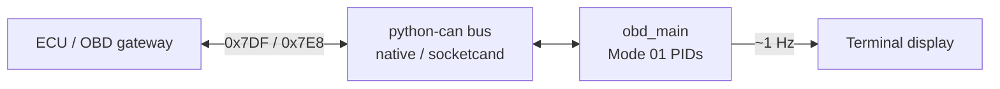

# obd-collector

Generic **OBD-II** (SAE J1979) terminal poller over CAN. Useful for basic bus/ECU sanity checks. It does **not** speak Subaru SSM and will not expose Subaru-only channels (knock, DAM, etc.) — use [`../ssm-collector/`](../ssm-collector/) for that.

## Role

| Piece | Responsibility |
|-------|----------------|
| **This tool** (`obd_main.py`) | Query standard Mode 01 PIDs ~1 Hz; print live values in the terminal |
| **SSM collector** (`../ssm-collector/`) | High-rate proprietary SSM logging / WebSocket feed |
| **Dashboard** (`../autopi-app/`) | SSM UI only (does not use this OBD path) |

Run via the repo entry point:

```bash
uv run src/main.py --obd
```

## Data flow



Requests go to the OBD functional broadcast ID `0x7DF`; responses are expected on `0x7E8`.

## Structure

```
obd-collector/
├── README.md       ← this file
├── obd_main.py     OBD-II poll loop + terminal UI
└── test/           Placeholder for OBD tests
```

### `obd_main.py`

- Opens CAN via `CAN_MODE=native` (SocketCAN `can0`) or `socketcand`
- Polls a fixed PID set once per second: RPM, speed, coolant, throttle, MAF, O₂ voltage
- Decodes payloads with standard Mode 01 formulas
- Redraws an in-place terminal table (Ctrl-C to quit)

## Config (env)

| Variable | Purpose |
|----------|---------|
| `CAN_MODE` | `native` (default) or `socketcand` |
| `SOCKETCAND_HOST` / `SOCKETCAND_PORT` | Remote CAN when using socketcand |

## Related

- SSM stack: [`../ssm-collector/README.md`](../ssm-collector/README.md)
- Dashboard: [`../autopi-app/README.md`](../autopi-app/README.md)
- System overview: [repo README](../../README.md)
- Run / deploy: [SETUP.md](../../SETUP.md)
