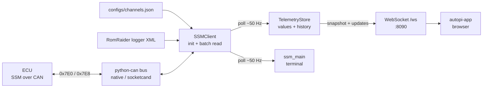

# ssm-collector

Subaru **SSM** (Subaru Select Monitor) stack for this project. Talks to the ECU over CAN (ISO-TP), reads calibrated memory addresses, and either prints values in a terminal or streams them to clients over a WebSocket.

The dashboard (`../autopi-app/`) does **not** poll the car; it consumes this collector’s feed.

## Role

| Mode | Entry | What it does |
|------|--------|----------------|
| **Collector** (service) | `uv run src/main.py --collector` | Poll SSM ~50 Hz; push updates ~20 Hz on `ws://…:8090/ws` |
| **Terminal logger** | `uv run src/main.py` (default) | Same SSM poll path; in-place terminal display |

Shared pieces (`ssm_client`, `ssm_runtime`, `raider_reader`) implement the protocol and RomRaider config loading for both modes.

## Data flow



**Which params to poll** come from committed [`configs/channels.json`](configs/channels.json): each entry has `id`, `enabled`, and optional `info` (units/key/label/min/max for humans only). The collector reads **only** `id` + `enabled`. **Addresses, units, labels, and gauge bounds** come from the RomRaider logger XML (first conversion; selected by the 5-byte ECU ID from SSM init, overridable with `SSM_ECU_ID`). On a laptop, `ROMRAIDER_XML` usually points under `docs/romraider/`. `./deploy.sh` copies that file to `configs/<same-filename>.xml` on the Pi only; at runtime the Pi loads the single `*.xml` in `configs/`.

UI colors/thresholds live separately in `../autopi-app/configs/` — channel `key` values are RomRaider ids lowercased (`p2`, `e31`, `s142`, …).

**Switches** (RomRaider `<switch>`, e.g. `S142` Parking Position Switch) are valid channel ids. They share the same A8 batch-read path as parameters; decode extracts one bit from the byte (`0` / `1`, units `bool`). Enable in `channels.json` like any other id:

```json
{
  "id": "S142",
  "enabled": true,
  "info": {
    "units": "bool",
    "key": "s142",
    "label": "Parking Position Switch",
    "min": 0.0,
    "max": 1.0
  }
}
```

WebSocket meta includes `"kind": "switch"` for these channels. On the Teensy bench sim, SW2 toggles S142 (`0x0000D6` bit 7).

## Structure

```
ssm-collector/
├── README.md           ← this file
├── ssm_client.py       SSM/ISO-TP protocol + param decode
├── raider_reader.py    RomRaider logger XML → param map / SsmParam
├── ssm_runtime.py      CAN bus setup, ECU ID, load params / channel specs
├── ssm_collector.py    FastAPI collector service (WebSocket feed)
├── ssm_main.py         Terminal live logger (no network UI)
├── configs/
│   ├── channels.json   Collector poll list (committed)
│   └── *.xml           Pi-only RomRaider copy (gitignored; from deploy.sh)
└── test/
│   └── validate_teensy_ssm.py  XML ↔ Teensy header + live CAN checks
```

### Bench validation (Teensy)

With the companion Teensy simulator flashed and (for live mode) CAN reachable:

```bash
# Addresses/lengths: RomRaider XML ↔ Teensy ssm_addresses.h ↔ channels.json
uv run src/ssm-collector/test/validate_teensy_ssm.py --offline

# Also SSM init + single/batch reads over CAN (CAN_MODE from .env)
uv run src/ssm-collector/test/validate_teensy_ssm.py
```

### `ssm_client.py`

Low-level SSM over CAN:

- Request `0x7E0` → response `0x7E8`
- ISO-TP framing
- Commands: init (`0xBF`), batch read (`0xA8`)
- `SsmParam` — address, length, conversion expr → engineering units; optional `bit` for switches → 0/1

### `raider_reader.py`

Reads RomRaider `logger_*.xml` directly:

- Path from `ROMRAIDER_XML` (repo-relative or absolute)
- Standard `<parameter>` + `<switch>` + per-ECU `<ecuparam>` under protocol `SSM`
- CLI: `uv run src/ssm-collector/raider_reader.py --summary`

### Channel catalog setup (`ssm_collector_setup.sh`)

From the **repo root**, generate a full disabled catalog from your RomRaider XML:

```bash
./ssm_collector_setup.sh
```

The script:

1. Requires a laptop `.env` (suggests `cp .env.example .env` if missing)
2. Requires `ROMRAIDER_XML` in that file
3. Requires that XML path to exist on disk
4. Runs `generate_channels_json.py` → `configs/channels.generated.json` (gitignored)

You can also call the generator directly:

```bash
uv run src/ssm-collector/generate_channels_json.py
```

**Choosing what to poll:** open `configs/channels.generated.json`, find the params you want (search by `id` or by `info.label` / `info.units`), and copy those objects into the committed [`configs/channels.json`](configs/channels.json). Set `"enabled": true` on each. Example shape:

```json
{
  "id": "P2",
  "enabled": true,
  "info": {
    "units": "F",
    "key": "p2",
    "label": "Coolant Temperature",
    "min": 0.0,
    "max": 240.0
  }
}
```

- Runtime uses **only** `id` and `enabled`.
- `info` is for humans (and for matching dashboard `key`s — use the RomRaider id lowercased, e.g. `p2`, in `../autopi-app/configs/`).
- Do not point `--out` at `channels.json` unless you intend to replace the whole poll list; prefer copy/paste from the generated file so you keep a small enabled set.

### `ssm_runtime.py`

Shared startup helpers:

- `create_bus()` — `CAN_MODE=native` (SocketCAN `can0`) or `socketcand`
- `load_enabled_channel_ids()` — enabled ids from `configs/channels.json`
- `load_params(ecu_id, ids)` — resolve IDs from RomRaider XML
- `resolve_ecu_id()` — prefer `SSM_ECU_ID` when set

### `ssm_collector.py`

Long-running service used by the dashboard:

- Background thread: SSM init → batch poll → `TelemetryStore`
- Async broadcast loop: JSON `update` messages to connected WS clients
- Endpoints: `/ws` (snapshot then updates), `/snapshot`, `/health`
- Poll channel set from `configs/channels.json` (P2, P11, E31, E41, P9 by default)

Defaults: `COLLECTOR_HOST=0.0.0.0`, `COLLECTOR_PORT=8090`.

### `ssm_main.py`

Dev/diagnostic UI in the terminal: larger param list (`DISPLAY_PARAMS`), ~50 Hz poll, ~10 Hz screen refresh. Same client/runtime stack as the collector.

## Config (env)

| Variable | Purpose |
|----------|---------|
| `CAN_MODE` | `native` (default) or `socketcand` |
| `SOCKETCAND_HOST` / `SOCKETCAND_PORT` | Remote CAN when using socketcand |
| `SSM_ECU_ID` | Force address map (e.g. `5C42504007`) |
| `ROMRAIDER_XML` | Laptop path to logger XML; omitted on Pi (discovers `configs/*.xml`) |
| `COLLECTOR_HOST` / `COLLECTOR_PORT` | Collector bind address |

## Related

- Dashboard: [`../autopi-app/README.md`](../autopi-app/README.md)
- System overview: [repo README](../../README.md)
- Run / deploy: [SETUP.md](../../SETUP.md)
