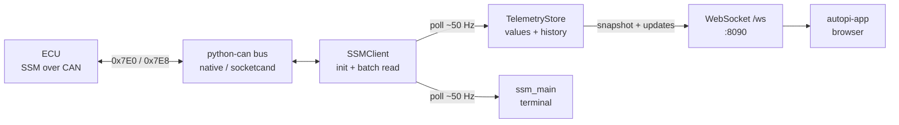

# ssm-collector

Subaru **SSM** (Subaru Select Monitor) stack for this project. Talks to the ECU over CAN (ISO-TP), reads calibrated memory addresses, and either prints values in a terminal or streams them to clients over a WebSocket.

The dashboard (`../autopi-app/`) does **not** poll the car; it consumes this collector’s feed.

## Role

| Mode | Entry | What it does |
|------|--------|----------------|
| **Collector** (service) | `uv run src/main.py --collector` | Poll SSM ~50 Hz; push updates ~20 Hz on `ws://…:8090/ws` |
| **Terminal logger** | `uv run src/main.py` (default) | Same SSM poll path; in-place terminal display |

Shared pieces (`ssm_client`, `ssm_runtime`) implement the protocol and config loading for both modes.

## Data flow



Address maps and conversion formulas come from `configs/ssm_configs.json` (selected by the 5-byte ECU ID from SSM init, overridable with `SSM_ECU_ID`).

## Structure

```
ssm-collector/
├── README.md           ← this file
├── ssm_client.py       SSM/ISO-TP protocol + param decode
├── ssm_runtime.py      CAN bus setup, ECU ID, load params from JSON
├── ssm_collector.py    FastAPI collector service (WebSocket feed)
├── ssm_main.py         Terminal live logger (no network UI)
├── configs/
│   └── ssm_configs.json  Address maps + conversions (generated)
└── test/               Placeholder for collector tests
```

### `ssm_client.py`

Low-level SSM over CAN:

- Request `0x7E0` → response `0x7E8`
- ISO-TP framing
- Commands: init (`0xBF`), batch read (`0xA8`)
- `SsmParam` — address, length, conversion expr → engineering units

### `ssm_runtime.py`

Shared startup helpers:

- `create_bus()` — `CAN_MODE=native` (SocketCAN `can0`) or `socketcand`
- `load_params(ecu_id, specs)` — resolve IDs from `ssm_configs.json`
- `resolve_ecu_id()` — prefer `SSM_ECU_ID` when set

### `ssm_collector.py`

Long-running service used by the dashboard:

- Background thread: SSM init → batch poll → `TelemetryStore`
- Async broadcast loop: JSON `update` messages to connected WS clients
- Endpoints: `/ws` (snapshot then updates), `/snapshot`, `/health`
- Dashboard channel set is `DASHBOARD_SPECS` (coolant, IAT, DAM, fine knock)

Defaults: `COLLECTOR_HOST=0.0.0.0`, `COLLECTOR_PORT=8090`.

### `ssm_main.py`

Dev/diagnostic UI in the terminal: larger param list (`DISPLAY_PARAMS`), ~50 Hz poll, ~10 Hz screen refresh. Same client/runtime stack as the collector.

## Config (env)

| Variable | Purpose |
|----------|---------|
| `CAN_MODE` | `native` (default) or `socketcand` |
| `SOCKETCAND_HOST` / `SOCKETCAND_PORT` | Remote CAN when using socketcand |
| `SSM_ECU_ID` | Force address map (e.g. `5C42504007`) |
| `COLLECTOR_HOST` / `COLLECTOR_PORT` | Collector bind address |

## Related

- Dashboard: [`../autopi-app/README.md`](../autopi-app/README.md)
- System overview: [repo README](../../README.md)
- Run / deploy: [SETUP.md](../../SETUP.md)
